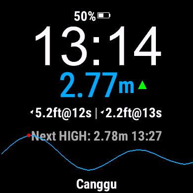

# Tide Watch

Tide Watch is a powerful and customizable Garmin watch face designed for surfers and coastal enthusiasts. It provides real-time tide and swell data directly on your wrist, helping you stay informed about the latest conditions at your favorite surf spots.

## Key Features

- **Tide & Swell Graphs**: High-resolution graphs that visualize tide and optional swell height trends over time.
- **Surfline Integration**: Pulls accurate data using a Surfline Spot ID.
- **Customizable Units**: Toggle between Metric (Meters) and Imperial (Feet) for tide and swell heights.
- **Rich Personalization**:
  - Choose from a wide palette of colors for tide height, the tide graph, and base text.
  - Optional swell graph layering.
  - Toggle date and day display for a cleaner look.
- **Comprehensive Device Support**: Compatible with a vast range of Garmin devices including Fenix, Forerunner, Venu, Instinct, epix, and more.
- **Smart Background Updates**: Efficient data fetching to minimize battery impact while keeping indicators up-to-date.

## Configuration

To set up Tide Watch:
1.  **Surfline Spot ID**: Find the Spot ID for your location on Surfline.com and enter it in the watch face settings via Garmin Connect IQ.
2.  **Units**: Select your preferred units for tide and swell heights.
3.  **Colors**: Personalize the appearance by choosing colors for the graph and text elements.

## Supported Devices

Tide Watch supports most modern Garmin wearables, including:
- **Fenix** (5 Plus, 6, 7, 8, E and Solar editions)
- **Forerunner** (55, 165, 245, 255, 265, 945, 955, 965, 970)
- **Venu** (Original, 2, 3, 4, Sq, Sq 2)
- **Instinct** (2, 3, Crossover)
- **Descent** (G1, G2, Mk2, Mk3)
- **Epix** (Gen 2, Pro editions)
- **MARQ** (Original and Gen 2)
- **Vivoactive** (3m, 4, 5, 6)

## License

**Copyright (c) 2026 Tide Watch Developers**

This software (the "App") is free to use for personal purposes. However, you are **strictly prohibited** from forking, modifying, editing, or redistributing the source code or any derivative works of this App.

The software is provided "as is", without warranty of any kind.
